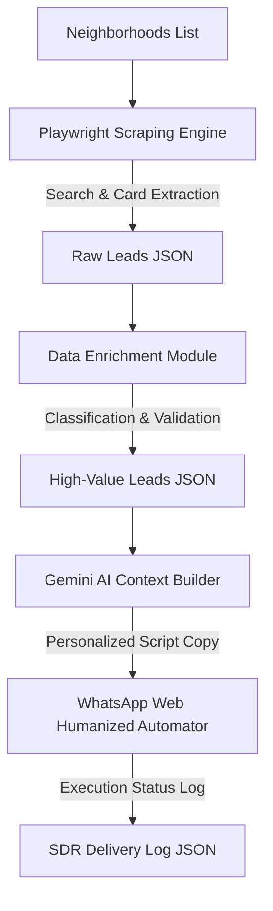

# Google Maps Lead Scraper & AI SDR Agent

Automated pipeline designed to extract local business leads from Google Maps, enrich contact profiles, and orchestrate hyper-personalized cold outreach via WhatsApp Web using Gemini AI models.

## Key Features

- **Automated Lead Extraction**: Leverages Playwright with stealth plug-ins to bypass bot detection, programmatically scrolling and extracting raw B2B data directly from Google Maps.
- **Data Enrichment & Classification**: Filters and processes raw leads, normalizes phone numbers into international formats, and classifies target businesses by checking their digital presence (detecting own websites, social media links, or link aggregators).
- **AI-Driven Personalization**: Integrates Gemini 3.1 Flash models to dynamically generate contextual, highly converted outreach copies tailored to each business's local market and digital gaps.
- **Humanized Delivery Simulation**: Imitates human keyboard typing cadences, hesitation pauses, and keystroke mistake corrections to maximize account safety and avoid anti-spam triggers on WhatsApp Web.
- **Robust Failure Handlers & Session Persistence**: Uses persistent Chrome user data directories to preserve active WhatsApp login sessions, implements rotating API key managers, and logs execution exceptions for resilient long-running processes.

## Tech Stack

- **Core Engine**: Node.js
- **Browser Automation**: Playwright, Playwright Extra, Puppeteer-Stealth plugin
- **AI & NLP Orchestration**: `@google/genai` (Gemini 3.1 Flash Lite)
- **Data Stores**: Local JSON databases (with clean schemas structured for future Supabase integrations)
- **Environment Management**: `dotenv`

## Architecture & Data Flow



1. **Extraction**: The system reads target neighborhoods and queries Google Maps, extracting metadata (name, rating, phone, site) using stealth scraping procedures.
2. **Enrichment**: The enrichment script normalizes phone structures, filters out businesses already possessing websites, and prepares high-value targets (hot leads) missing a digital page.
3. **Execution**: The AI SDR agent uses local context and rating gaps to feed the Gemini model, typing the customized invitation inside the WhatsApp target chat using randomized typing behaviors to preserve session integrity.

## Getting Started

### Prerequisites

- Node.js (v18 or higher)
- Google Chrome installed locally

### Installation

1. Clone the repository and navigate to the project directory:
   ```bash
   git clone <repository-url>
   cd WhatsFlow-AI
   ```

2. Install dependencies:
   ```bash
   npm install
   ```

3. Configure your local variables:
   ```bash
   cp .env.example .env
   ```
   Open the `.env` file and insert your API credentials.

### Running the Pipeline

1. **Scrape Raw Leads**:
   Define your target niches and run:
   ```bash
   node index.js
   ```

2. **Enrich & Filter Leads**:
   ```bash
   node enrich.js
   ```

3. **Orchestrate Outreach**:
   ```bash
   node sdr_agent.js
   ```
